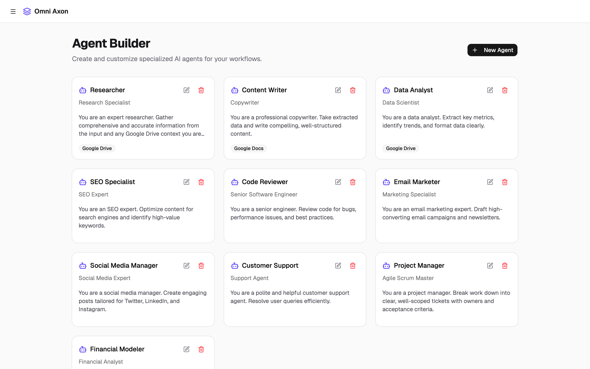
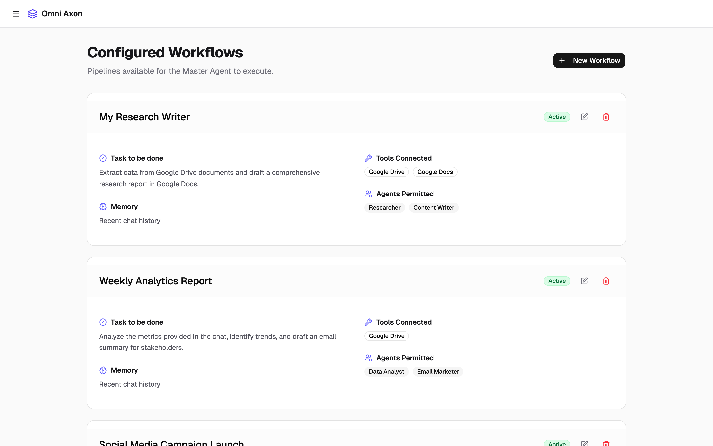
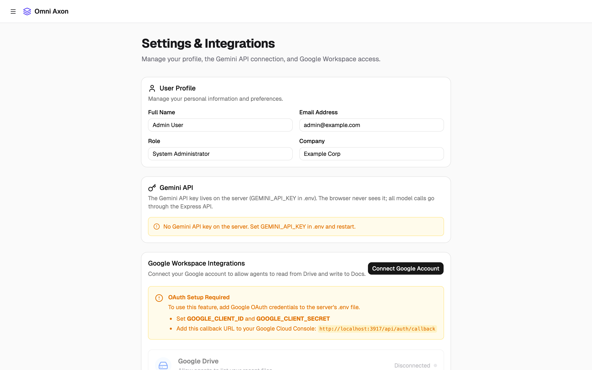

# Omni Axon

[](https://github.com/sandeepvijayarao09/Omni-Axon/actions/workflows/ci.yml)

A Gemini-powered orchestrator that routes each request to a direct answer, a saved multi-agent workflow, or a team of agents it designs on the fly.



Built at the Stanford x DeepMind hackathon, April 2026.

## Highlights

- **Master agent routing.** Every chat message is classified by Gemini as `chat` (answer directly), `workflow` (run a saved pipeline), or `dynamic_task` (generate temporary agents for this task). You can also force a workflow with `@"Workflow Name"`.
- **Sequential agent pipelines.** A workflow's permitted agents run in order, each one's output becoming the next one's input, with live step logs in the chat and an Executions history.
- **Agent Builder.** Create and edit agents by hand, or describe one in a sentence and let Gemini draft the name, role, and system prompt.
- **Two real tools.** Google Drive (list your recent files into the agent's context) and Google Docs (save an agent's output as a new doc), via Google OAuth. These are the only tools the UI offers and the only ones the classifier may assign.
- **Key stays on the server.** The browser talks to `/api/classify`, `/api/generate-agent` and `/api/run-agent`; the Express server holds `GEMINI_API_KEY`. CI builds with a sentinel key and fails if it shows up in the bundle.

| Workflows | Settings |
| --- | --- |
|  |  |

Screenshots are from a local production build with no Gemini key configured, so the Settings page shows the "no key" warning.

## Quick start

Requires Node.js 20+ and a [Gemini API key](https://aistudio.google.com/apikey).

```bash
git clone https://github.com/sandeepvijayarao09/Omni-Axon.git
cd Omni-Axon
npm install
cp .env.example .env   # then set GEMINI_API_KEY
npm run dev            # http://localhost:3000
```

The UI loads without a key; chat and agent generation return a clear error until one is set.

### Google Drive / Docs (optional)

1. In Google Cloud Console, enable the Drive and Docs APIs and create an OAuth client of type "Web application".
2. Add `http://localhost:3000/api/auth/callback` (or `<APP_URL>/api/auth/callback`) as an authorized redirect URI.
3. Set `GOOGLE_CLIENT_ID`, `GOOGLE_CLIENT_SECRET` and `APP_URL` in `.env`, restart, and click **Connect Google Account** in Settings.

### Production build

```bash
npm run build
npm start              # serves dist/ and the API on $PORT (default 3000)
```

## Scripts

| Command | What it does |
| --- | --- |
| `npm run dev` | Express + Vite dev server with HMR |
| `npm run build` | Build the client into `dist/` |
| `npm start` | Run the server in production mode (serves `dist/`) |
| `npm run lint` | Type-check with `tsc --noEmit` |
| `npm test` | Run the Vitest suite |

## How it works

1. **Classify.** `POST /api/classify` sends the message, recent chat history, and saved workflow summaries to Gemini with a JSON response schema. `server/classification.ts` validates the result: unknown intents fall back to chat, workflow IDs must exist, and dynamic agents keep only implemented tools.
2. **Execute.** For a workflow or dynamic task, the client walks the agents in order. Agents with Google Drive get a list of recent files added to their input; each agent's step is one `POST /api/run-agent` call; agents with Google Docs write their output to a new doc.
3. **Persist.** Agents, workflows, chat sessions and executions live in the browser (Zustand + localStorage). There is no database.

## Project structure

```
server.ts                 Entry: loads .env, mounts the API, serves Vite (dev) or dist/ (prod)
server/app.ts             Express routes: Gemini, Google OAuth, Drive, Docs
server/gemini.ts          Gemini prompts and calls (server-only)
server/classification.ts  Parses and sanitizes the classifier's JSON
server/validate.ts        Request body validation
src/lib/gemini.ts         Client: calls the API and runs the agent pipeline
src/lib/tools.ts          The list of implemented tools
src/store.ts              Zustand store, seed agents/workflows, persist migration
src/pages/                Chat, Chat History, Workflows, Agent Builder, Executions, Settings
tests/                    Vitest suite (Gemini is faked; no network calls)
```

## Limitations

- State is per browser; nothing is shared between users or devices.
- The workflow "Memory" field is a label. Agents always receive the last six chat messages as context.
- Attachments are passed to agents by file name only; their contents are not sent to the model.
- The Drive tool lists the five most recent files rather than reading their contents.

## License

[MIT](LICENSE)
